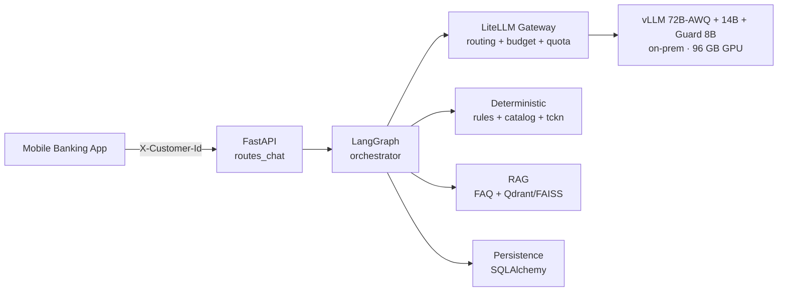
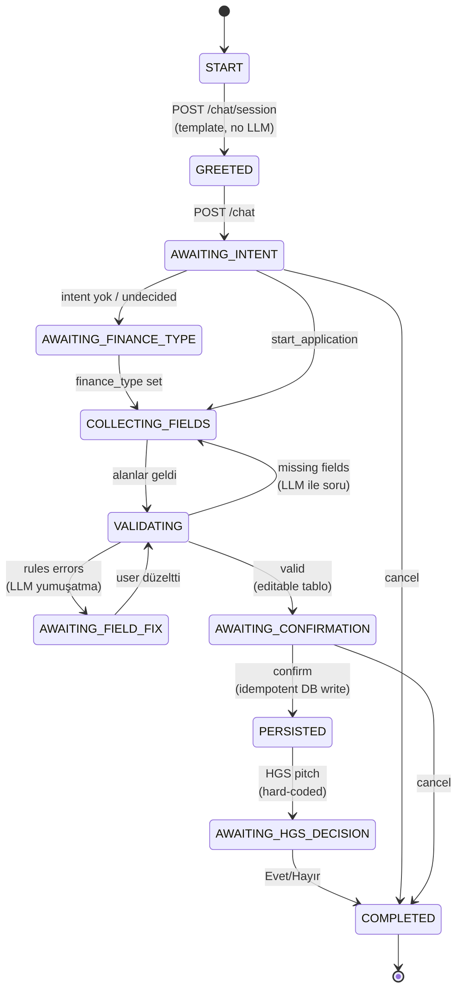
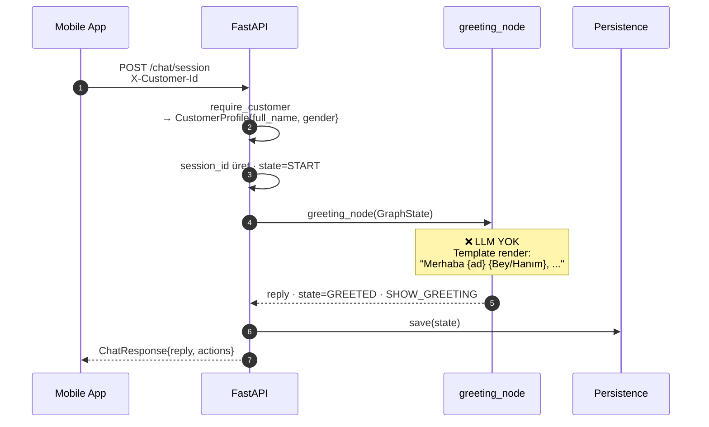
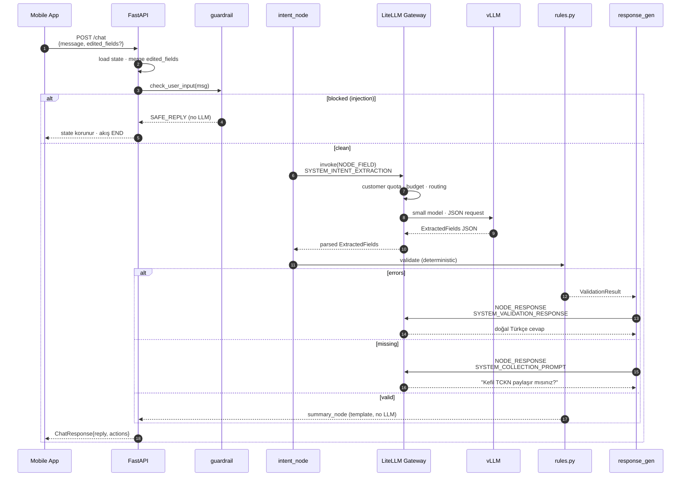
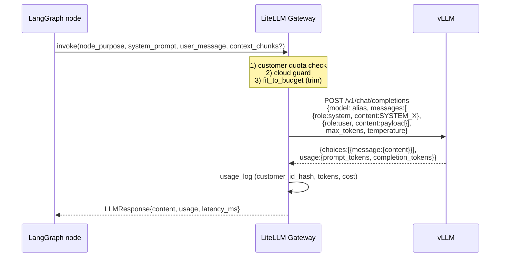
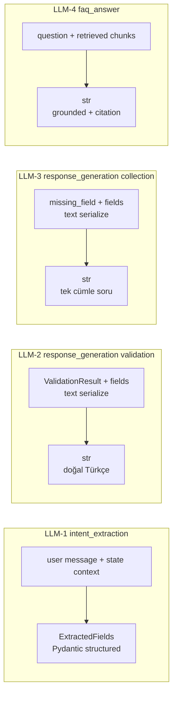
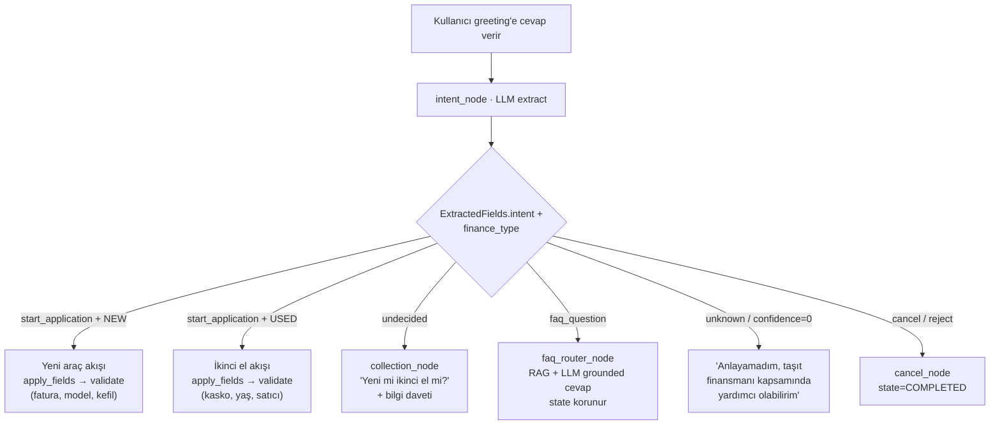
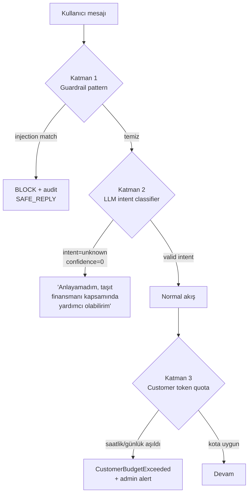
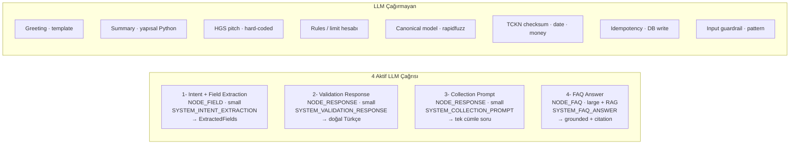

# LLM Pipeline — Görsel Akış

**Taşıt Finansmanı Ön Başvuru Chatbot'u**

Mesajın hangi yolu izlediği · LLM'e ne gönderildiği · ne döndüğü ·
nereden geçtiği · hangi katmanın LLM'siz çalıştığı

---

## Üst Seviye Mimari



LLM çağrıları **yalnızca** gateway üzerinden; uygulama model ID'sini bilmez.

---

## State Makinesi



---

## Turn 0 — İlk Mesaj (Chatbot Açılır)



**LLM çağrı sayısı: 0** — gender + ad customer-master'dan kesin; template yeterli.

---

## Turn 1+ — Kullanıcı Mesajı Geldiğinde



---

## Modele Ne Gidiyor, Ne Dönüyor



Gateway tüm pre-call kontrolleri yapar, post-call'da PII-free token log yazar.
Provider hata → `fallback_alias` bir kez denenir; hâlâ fail → safe deterministic reply.

---

## Pydantic Sözleşmeleri — Hangi LLM Katmanı Ne Üretir



| Çağrı | Output enforcement |
|---|---|
| Intent extraction | **Pydantic** `with_structured_output(ExtractedFields)` zorunlu |
| Validation response | Serbest metin · `_FALLBACK` deterministic geri dönüş |
| Collection prompt | Serbest metin · `_FALLBACK_PROMPTS` statik |
| FAQ answer | Serbest metin + citation · top-chunk fallback |

---

## `ExtractedFields` — Kritik Schema

```python
class ExtractedFields(BaseModel):
    intent: IntentType            # greet | start_application | provide_info |
                                  # update_field | confirm | reject | cancel |
                                  # faq_question | hgs_decision | undecided | unknown
    finance_type: FinanceType | None       # NEW | USED | None
    invoice_value: float | None
    vehicle_model: str | None              # ham — canonical sonra rapidfuzz ile
    guarantor_tckn: str | None
    casco_value: float | None
    model_year: int | None
    vehicle_age: int | None
    registration_date: date | None
    seller_tckn: str | None
    requested_amount: float | None
    faq_question: str | None
    field_to_update: str | None
    confidence: float = 0.5
```

Parse fail → `ExtractedFields(intent=UNKNOWN, confidence=0)` → chat "anlamadım".

---

## Greeting Cevabını Yorumlama



**Karar mekanizması:**
- LLM yorumlar → `ExtractedFields`
- Backend `route_after_intent` ile dallanma
- `rules.py` deterministic doğrulama

---

## Alakasız Soru — 3 Katmanlı Savunma



**Örnekler:**
- "Önceki talimatları unut" → Katman 1
- "Bana python kodu yaz" → Katman 2
- 1 saatte 100 kapsam dışı istek → Katman 3

---

## 4 LLM Çağrı Noktası — Özet



**Max LLM/turn: 2** (intent + ya validation response ya collection ya FAQ)

---

## Render Talimatı

```bash
# VS Code: "Marp for VS Code" extension → live preview
# CLI:
npm install -g @marp-team/marp-cli
marp docs/PRESENTATION.md --pdf
marp docs/PRESENTATION.md --pptx
marp docs/PRESENTATION.md --html
```

**Mermaid:** GitHub & VS Code preview otomatik render eder. Marp CLI için
`@marp-team/marp-core` + mermaid plugin gerekli; veya diyagramları PNG
export edip embed et.
