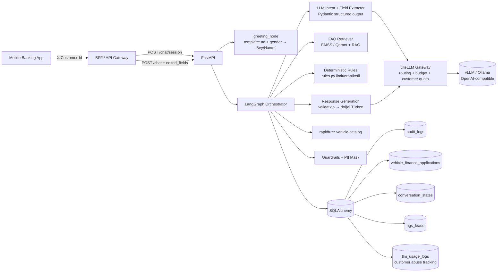
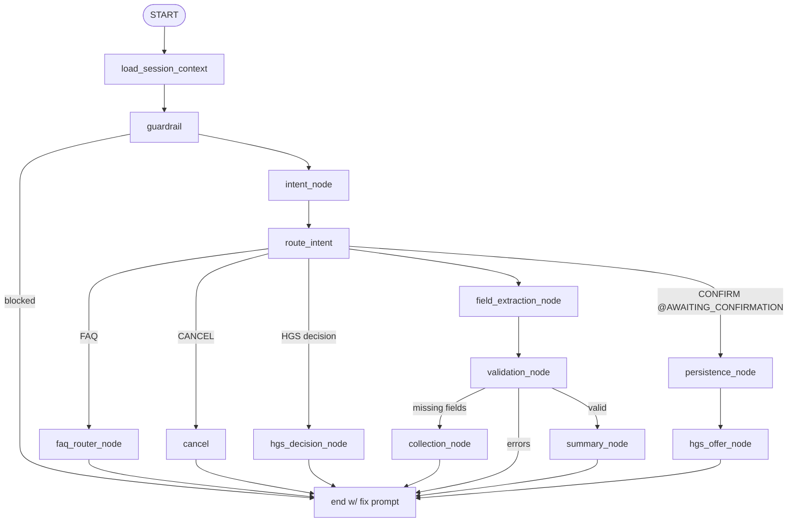
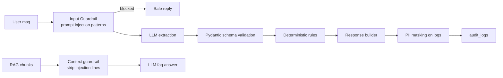
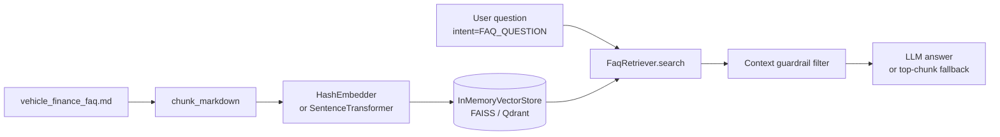
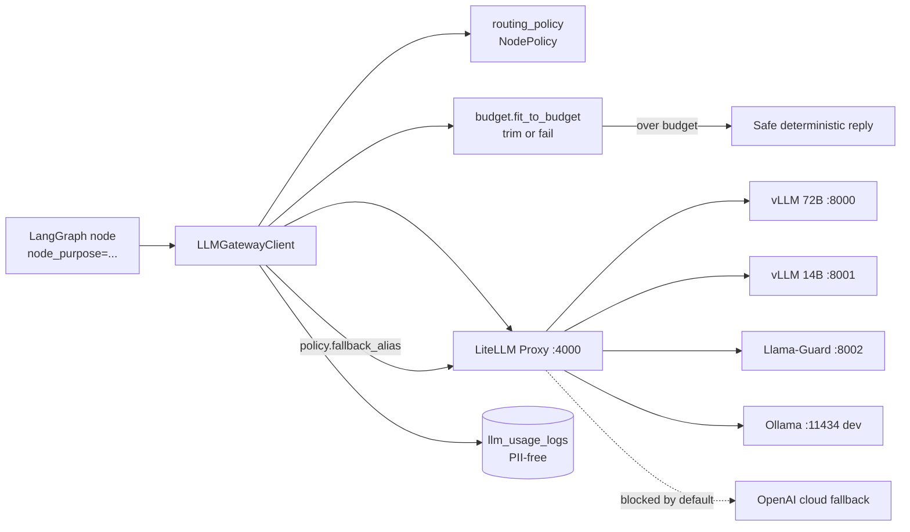

# Architecture

## 1. Sistem Görünümü

## 2. LangGraph Workflow (per turn)

Bütün yollar **tek bir reply** üretir. Her turn'de graph baştan çalışır;
state `ConversationRepository` üzerinden persist edilir.

## 3. Data Flow

1. Mobile app `X-Customer-Id` header'ı ile `POST /chat` yapar.
2. `require_customer` mock customer store'dan profili çeker.
3. `ConversationRepository.load` ile geçmiş state yüklenir.
4. `GraphState` oluşturulur ve LangGraph çalıştırılır.
5. Reply + actions kullanıcıya döner; state persist edilir.

## 4. Security Layer

## 5. RAG Flow

## 6. LLM Gateway (LiteLLM)

Application kod hiçbir model ID'sini bilmez; sadece `vehicle-finance-{small,large,guard}` alias'ları üzerinden iletişim kurar. Model swap = `infra/litellm/config.yaml` değişikliği + LiteLLM restart.

Cloud fallback **kod seviyesinde** kapatılmıştır (`_CLOUD_ALIASES` setine erken redaksiyon). Yalnızca `ENABLE_CLOUD_FALLBACK=true` env ile açılabilir; PII redaction adımı henüz tamamlanmadığı için MVP'de devre dışı kalmalı.

## 7. Production-grade Notları

- **Vehicle catalog**: `domain/vehicle_catalog.py` MVP mock'tur. Prod'da
  bankanın **kasko değer listesi** veya **araç model katalog** servisi
  ile değiştirilir. Binek/ticari ayrımı LLM ya da regex ile değil,
  servisin döndüğü model sınıfı üzerinden yapılır.
- **Conversation state**: bu MVP'de tek-row JSON tutuluyor. Prod'da
  LangGraph checkpointer'ı PostgreSQL'e bağlanmalı, history dedicated
  tabloya alınmalı.
- **TCKN**: stored masked. Prod'da `SecretStore` arkasına KMS/HSM bağlanıp
  encrypted at-rest tutulur. Anahtar rotasyonu ve audit'i ayrı politika.
- **Auth**: header tabanlı mock. Prod'da BFF imzalı JWT veya mTLS ile
  oturum kanıtı sunmalı; chat servisi customer-master üzerinden profili
  doğrulamalı.
- **Observability**: Langfuse veya LangSmith ile per-turn tracing,
  Prometheus ile latency / hata oranı metrikleri, Grafana paneli.
